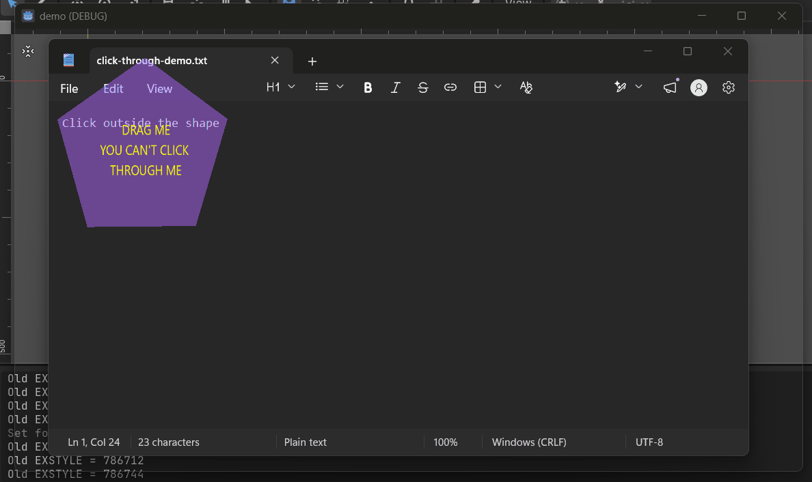

# Native Click Through

A Windows GDExtension for Godot 4 that allows selected regions of a transparent window to receive mouse input while the rest of the window remains click-through.

<p align="center">
  
</p>

Godot provides the interactive regions as polygons. The extension checks whether the system cursor is inside any registered polygon and updates the native Windows click-through state.

<!-- Add demo GIF here. -->

## Features

- Native click-through support for transparent Godot windows
- Supports multiple interactive polygons
- Interactive regions can move and change at runtime
- Simple GDScript API
- Does not use `mouse_passthrough_polygon`
- Does not use `WM_NCHITTEST`
- Includes debug and release binaries
- Includes a minimal draggable polygon demo

## Platform Support

| Platform | Architecture | Status        |
| -------- | -----------: | ------------- |
| Windows  |       x86_64 | Supported     |
| Linux    |            — | Not supported |
| macOS    |            — | Not supported |

The included binaries are built for Windows x86_64.

## Repository Structure

```text
native-click-through/
├── addons/
│   └── native_click_through/   # Distributable addon package
├── demo/                       # Minimal Godot demo project
├── doc_classes/                # Godot class documentation
├── godot-cpp/                  # godot-cpp Git submodule
├── src/                        # Native C++ source
├── SConstruct                  # SCons build configuration
├── README.md
└── LICENSE
```

## Installation

Copy:

```text
addons/native_click_through/
```

into your Godot project's `addons` directory:

```text
your_project/
└── addons/
    └── native_click_through/
        ├── bin/
        │   └── windows/
        │       ├── native_click_through.windows.template_debug.x86_64.dll
        │       └── native_click_through.windows.template_release.x86_64.dll
        ├── native_click_through.gdextension
        ├── README.md
        └── LICENSE
```

Godot loads the `.gdextension` file automatically.

This addon is not an `EditorPlugin`, so it does not require a `plugin.cfg` file and does not need to be enabled from the Plugins menu.

## Quick Start

```gdscript
extends Node2D

const POLYGON_ID := 1

@onready var polygon: Polygon2D = $Polygon2D

var native := NativeClickThrough.new()


func _ready() -> void:
	native.enable()
	_sync_polygon()


func _process(_delta: float) -> void:
	native.update()


func _sync_polygon() -> void:
	var window_points := PackedVector2Array()

	for local_point in polygon.polygon:
		window_points.append(
			polygon.to_global(local_point)
		)

	native.set_polygon(
		POLYGON_ID,
		window_points
	)


func _exit_tree() -> void:
	native.remove_polygon(POLYGON_ID)
	native.disable()
```

`NativeClickThrough` expects polygon points in window client coordinates.

Call `set_polygon()` again whenever the polygon moves, rotates, scales, or changes shape.

## Recommended Update Loop

`update()` checks the current system cursor position and updates the native window input state.

For most desktop overlay applications, running it at 30 to 60 Hz is enough:

```gdscript
func _ready() -> void:
	native.enable()
	_sync_polygon()

	var timer := Timer.new()

	timer.wait_time = 1.0 / 60.0
	timer.timeout.connect(native.update)

	add_child(timer)
	timer.start()
```

Only call `set_polygon()` when the polygon data or transform changes.

## API

### `enable()`

Initializes native click-through handling.

```gdscript
native.enable()
```

### `disable()`

Disables click-through handling and restores normal window input.

```gdscript
native.disable()
```

### `set_polygon(id, points)`

Creates or replaces an interactive polygon.

```gdscript
native.set_polygon(1, points)
```

Parameters:

- `id`: unique polygon identifier
- `points`: polygon vertices in window client coordinates

### `remove_polygon(id)`

Removes one registered polygon.

```gdscript
native.remove_polygon(1)
```

### `clear()`

Removes all registered polygons.

```gdscript
native.clear()
```

### `update()`

Checks whether the cursor is inside any registered polygon and updates the native window click-through state.

```gdscript
native.update()
```

## Running the Demo

The demo does not commit a second copy of the addon.

Copy the addon into the demo project:

```powershell
New-Item -ItemType Directory -Force demo\addons

Copy-Item `
	-Path addons\native_click_through `
	-Destination demo\addons `
	-Recurse `
	-Force
```

Then open:

```text
demo/project.godot
```

The demo contains a draggable `Polygon2D`.

- Mouse input inside the polygon is handled by Godot.
- Mouse input outside the polygon passes through the Godot window.
- Moving the polygon updates its native interactive region.

## Transparent Window Configuration

Click-through behavior and transparent rendering are separate features.

Configure transparency in the Godot project:

```ini
[display]

window/per_pixel_transparency/allowed=true
window/size/transparent=true

[rendering]

environment/defaults/default_clear_color=Color(0, 0, 0, 0)
```

The addon only manages native mouse input behavior. It does not configure window transparency, borderless mode, window size, or always-on-top behavior.

## Building from Source

### Requirements

- Python
- SCons
- Git
- Visual Studio Build Tools with C++ support
- Windows SDK
- A compatible version of `godot-cpp`

Clone the repository with its submodules:

```powershell
git clone --recursive <repository-url>
```

For an existing clone:

```powershell
git submodule update --init --recursive
```

Build the debug binary:

```powershell
py -m SCons platform=windows arch=x86_64 target=template_debug
```

Build the release binary:

```powershell
py -m SCons platform=windows arch=x86_64 target=template_release
```

The compiled DLLs are copied into:

```text
addons/native_click_through/bin/windows/
```

Expected output:

```text
native_click_through.windows.template_debug.x86_64.dll
native_click_through.windows.template_release.x86_64.dll
```

## How It Works

```text
Godot calculates polygon points
            ↓
set_polygon(id, points)
            ↓
The extension caches the polygons
            ↓
update() reads the system cursor position
            ↓
GetCursorPos
            ↓
ScreenToClient
            ↓
Point-in-polygon test
            ↓
WS_EX_TRANSPARENT enabled or disabled
```

Godot remains responsible for:

- Rendering
- Animation
- Physics
- Scene management
- Polygon generation
- Transform updates

The extension is responsible for:

- Reading native Windows cursor coordinates
- Testing the cursor against registered polygons
- Updating the native click-through window style

## Performance Notes

- Run `update()` at 30 to 60 Hz.
- Only call `set_polygon()` when a polygon changes.
- Remove unused polygons with `remove_polygon()`.
- Avoid unnecessary logging inside the update loop.
- Prefer reasonably simple polygons.

## Limitations

- Windows only
- Included binaries support x86_64 only
- The extension does not generate polygons automatically
- The extension does not inspect the Godot scene tree
- The extension does not configure transparent rendering
- Projects using custom viewport scaling may require coordinate conversion

## License

This project is licensed under the MIT License.

See [LICENSE](LICENSE) for details.

## Author

Khang Quach
